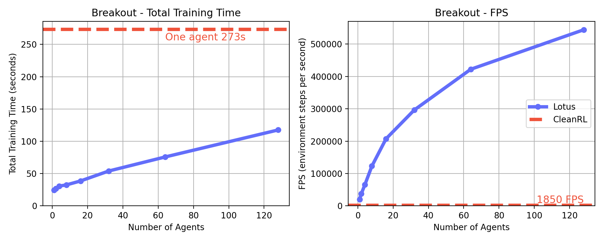

<div align="center">

  <h1> 🪷 Lotus</h1>
  
  <h3>A high-performance JAX reinforcement learning library</h3>
  
  [](https://www.python.org/)
  [](https://opensource.org/licenses/Apache-2.0)

</div>

---

Lotus is a lightweight reinforcement learning library written in pure JAX (Flax). It supports `jit`, `vmap`, and `pmap` for fast and scalable training on hardware accelerators.

### Install

Clone the repository and install dependencies:

```
git clone https://github.com/auxeno/lotus
pip install -r lotus/requirements.txt
```

### Quick Start

Train multiple PPO agents on 100 different seeds in parallel:

```python
from lotus import PPO

# Create agent and seeds
agent = PPO.create(env='Breakout-MinAtar')
seeds = jnp.arange(100)

# Vectorised training
train_fn = jax.vmap(agent.train, in_axes=(None, 0))
trained_agents = train_fn(agent, seeds)
```


[](https://colab.research.google.com/github/auxeno/lotus/blob/main/notebooks/lotus_demo.ipynb)

See the Colab notebook for more examples and advanced usage.

### Performance

PPO performance comparison for Lotus and CleanRL on the MinAtar Breakout environment. Agents were trained for 500,000 steps with an RTX 4090.



### Supported Algorithms

| Algorithm     | Discrete | Continuous | Paper                        |
|---------------|----------|------------|------------------------------|
| [DQN](https://github.com/Auxeno/lotus/blob/main/lotus/algos/dqn.py)           | ✔        |            | [Mnih et al. 2013](https://arxiv.org/abs/1312.5602) |
| [QR-DQN](https://github.com/Auxeno/lotus/blob/main/lotus/algos/qrdqn.py)        | ✔        |            | [Dabney et al. 2017](https://arxiv.org/abs/1710.10044) |
| [PQN](https://github.com/Auxeno/lotus/blob/main/lotus/algos/pqn.py)           | ✔        |            | [Gallici et al. 2024](https://arxiv.org/abs/2407.04811) |
| [DDPG](https://github.com/Auxeno/lotus/blob/main/lotus/algos/ddpg.py)        |          | ✔          | [Lillicrap et al. 2015](https://arxiv.org/abs/1509.02971) |
| [TD3](https://github.com/Auxeno/lotus/blob/main/lotus/algos/td3.py)        |          | ✔          | [Fujimoto et al. 2018](https://arxiv.org/abs/1802.09477) |
| [SAC](https://github.com/Auxeno/lotus/blob/main/lotus/algos/sac.py)        |          | ✔          | [Haarnoja et al. 2018](https://arxiv.org/abs/1801.01290) |
| [PPO](https://github.com/Auxeno/lotus/blob/main/lotus/algos/ppo.py)           | ✔        |            | [Schulman et al. 2017](https://arxiv.org/abs/1707.06347) |
| [Recurrent PPO](https://github.com/Auxeno/lotus/blob/main/lotus/algos/rppo.py)           | ✔        |            | - |